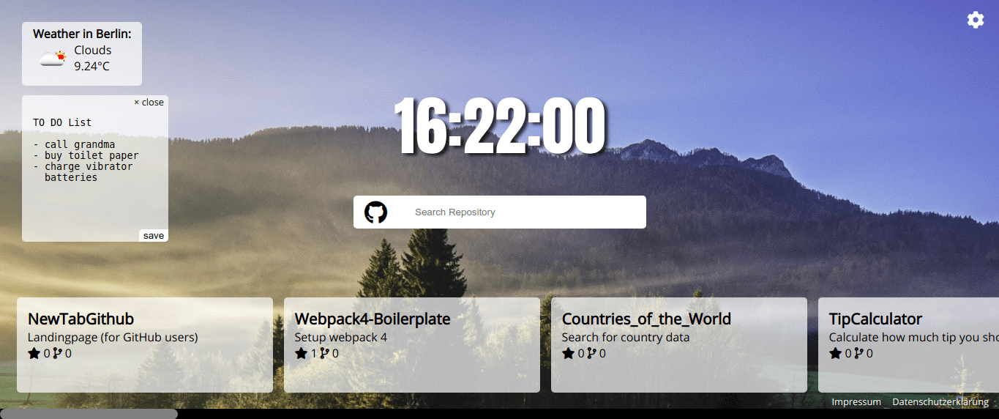

# New Tab Page (used GitHub API and moment.js)

    

## NewTabPage with current time and github repositories

## NewTabPage with settings container

---

[&copy; Peter R. Stuhlmann Webentwicklung](https://peter-stuhlmann-webentwicklung.de)